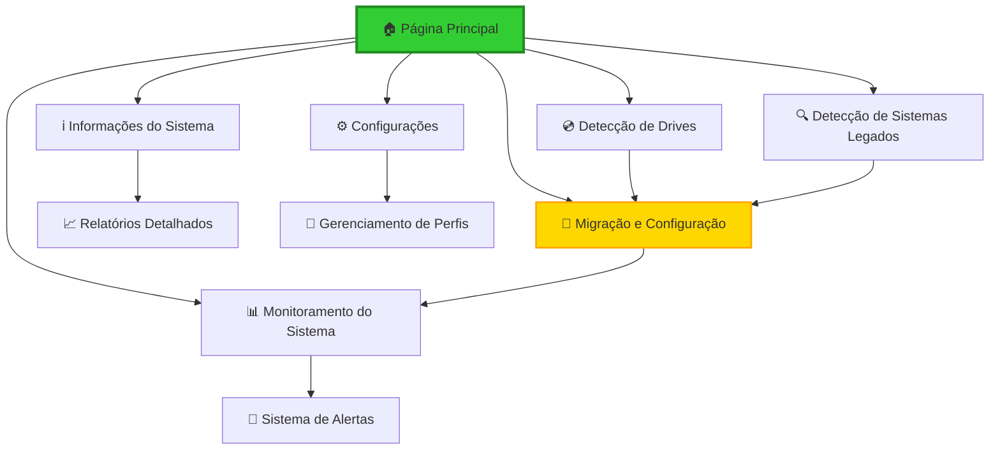

# 📋 FrontEmu-Tools - Documento de Requisitos do Produto (PRD)

## 1. Visão Geral do Produto

O **FrontEmu-Tools** é uma evolução revolucionária do SD Emulation GUI, projetado como um frontend completo e moderno para gerenciamento de emulação. O projeto visa unificar e otimizar a experiência de emulação através de uma arquitetura limpa, interface intuitiva e funcionalidades avançadas de automação.

**Principais objetivos:** Simplificar o gerenciamento de emuladores, automatizar a detecção e migração de sistemas legados, e fornecer uma interface unificada para controle completo do ambiente de emulação.

**Valor de mercado:** Atender à crescente demanda por soluções de emulação profissionais, oferecendo uma alternativa moderna e eficiente às ferramentas fragmentadas atualmente disponíveis.

## 2. Recursos Principais

### 2.1 Funções do Usuário

| Função | Método de Registro | Permissões Principais |
|--------|-------------------|----------------------|
| **Usuário Básico** | Instalação direta | Pode usar funcionalidades básicas de detecção e configuração |
| **Usuário Avançado** | Configuração manual | Pode acessar configurações avançadas, scripts personalizados e monitoramento detalhado |
| **Administrador** | Modo elevado | Pode modificar configurações do sistema, criar links simbólicos e gerenciar múltiplos perfis |

### 2.2 Módulo de Recursos

Nossos requisitos do FrontEmu-Tools consistem nas seguintes páginas principais:

1. **Página Principal**: painel de controle central, navegação entre módulos, status do sistema em tempo real
2. **Informações do Sistema**: detalhes de hardware e software, monitoramento de recursos, estatísticas de uso
3. **Detecção de Drives**: identificação automática de unidades, análise de espaço disponível, configuração de drives base e destino
4. **Detecção de Sistemas Legados**: escaneamento automático de emuladores existentes, análise de configurações, preparação para migração
5. **Migração e Configuração**: processo guiado de migração, criação de links simbólicos, backup de configurações originais
6. **Monitoramento do Sistema**: estatísticas em tempo real, alertas de performance, logs de atividade
7. **Configurações**: preferências da aplicação, configurações avançadas, gerenciamento de perfis

### 2.3 Detalhes da Página

| Nome da Página | Nome do Módulo | Descrição do Recurso |
|----------------|----------------|---------------------|
| **Página Principal** | Painel de Controle | Exibir status geral do sistema, navegação rápida entre módulos, alertas importantes |
| **Página Principal** | Status em Tempo Real | Mostrar informações de CPU, memória, disco em tempo real com gráficos |
| **Informações do Sistema** | Detalhes de Hardware | Listar processador, memória, placas gráficas, dispositivos de armazenamento |
| **Informações do Sistema** | Detalhes de Software | Mostrar sistema operacional, drivers, versões de DirectX/OpenGL |
| **Detecção de Drives** | Scanner de Unidades | Detectar automaticamente todas as unidades disponíveis, analisar tipo e capacidade |
| **Detecção de Drives** | Configuração de Drives | Permitir seleção de drive base e destino, validar espaço disponível |
| **Detecção de Sistemas Legados** | Scanner de Emuladores | Buscar automaticamente emuladores instalados em locais padrão |
| **Detecção de Sistemas Legados** | Análise de Configurações | Examinar arquivos de configuração, ROMs, saves existentes |
| **Migração e Configuração** | Assistente de Migração | Guiar usuário através do processo de migração passo a passo |
| **Migração e Configuração** | Criação de Links Simbólicos | Criar links simbólicos para ROMs, saves e configurações |
| **Migração e Configuração** | Sistema de Backup | Fazer backup automático de configurações originais antes da migração |
| **Monitoramento do Sistema** | Estatísticas em Tempo Real | Mostrar uso de CPU, memória, disco, rede em gráficos dinâmicos |
| **Monitoramento do Sistema** | Sistema de Alertas | Notificar sobre problemas de performance, espaço em disco baixo |
| **Configurações** | Preferências Gerais | Configurar idioma, tema, comportamentos automáticos |
| **Configurações** | Configurações Avançadas | Ajustar parâmetros técnicos, caminhos personalizados, scripts |

## 3. Processo Principal

### Fluxo do Usuário Básico

O usuário inicia a aplicação e é apresentado ao painel principal com status do sistema. Navega para a detecção de drives para configurar unidades base e destino. Executa a detecção de sistemas legados para identificar emuladores existentes. Utiliza o assistente de migração para transferir configurações e criar links simbólicos. Monitora o sistema através das estatísticas em tempo real.

### Fluxo do Usuário Avançado

O usuário avançado acessa configurações detalhadas para personalizar comportamentos automáticos. Configura scripts personalizados para automação adicional. Utiliza ferramentas de monitoramento avançado para análise de performance. Gerencia múltiplos perfis de configuração para diferentes cenários.

### Fluxograma de Navegação

## 4. Design da Interface do Usuário

### 4.1 Estilo de Design

**Cores Principais:**
- **Primária**: Verde Lima (#32CD32) - Representa energia e modernidade
- **Secundária**: Verde Escuro (#228B22) - Para elementos de destaque
- **Accent**: Dourado (#FFD700) - Para alertas e notificações importantes
- **Fundo**: Cinza Escuro (#2B2B2B) - Tema escuro moderno
- **Texto**: Branco (#FFFFFF) e Cinza Claro (#E0E0E0)

**Estilo de Botões:**
- Botões arredondados com bordas suaves (border-radius: 8px)
- Efeitos de hover com transições suaves
- Ícones integrados para melhor usabilidade
- Estados visuais claros (normal, hover, pressed, disabled)

**Tipografia:**
- **Fonte Principal**: Segoe UI (Windows), SF Pro (macOS), Ubuntu (Linux)
- **Tamanhos**: Títulos (24px), Subtítulos (18px), Texto (14px), Pequeno (12px)
- **Pesos**: Regular (400), Semibold (600), Bold (700)

**Estilo de Layout:**
- Design baseado em cards com sombras sutis
- Navegação lateral retrátil
- Grid responsivo para diferentes resoluções
- Espaçamento consistente (8px, 16px, 24px, 32px)

**Ícones e Emojis:**
- Ícones Material Design para consistência
- Emojis para elementos lúdicos e identificação rápida
- Tamanhos padronizados (16px, 24px, 32px, 48px)

### 4.2 Visão Geral do Design da Página

| Nome da Página | Nome do Módulo | Elementos da UI |
|----------------|----------------|-----------------|
| **Página Principal** | Painel de Controle | Header com logo e navegação, cards de status com ícones coloridos, barra lateral com menu principal, footer com informações de versão |
| **Página Principal** | Status em Tempo Real | Gráficos circulares para CPU/Memória, gráficos de linha para histórico, indicadores de status com cores semafóricas |
| **Informações do Sistema** | Detalhes de Hardware | Tabelas organizadas com ícones, barras de progresso para capacidades, cards expansíveis para detalhes |
| **Detecção de Drives** | Scanner de Unidades | Lista de drives com ícones de tipo, barras de capacidade coloridas, botões de ação com confirmação |
| **Detecção de Sistemas Legados** | Scanner de Emuladores | Cards de emuladores detectados, badges de status, botões de ação contextuais |
| **Migração e Configuração** | Assistente de Migração | Wizard com steps visuais, barras de progresso, confirmações com preview |
| **Monitoramento do Sistema** | Estatísticas em Tempo Real | Dashboard com múltiplos gráficos, alertas em tempo real, histórico navegável |
| **Configurações** | Preferências Gerais | Formulários organizados em seções, toggles e sliders, preview de mudanças |

### 4.3 Responsividade

O FrontEmu-Tools é projetado com abordagem **desktop-first** otimizada para:

- **Resolução Mínima**: 1280x720 (HD)
- **Resolução Recomendada**: 1920x1080 (Full HD)
- **Suporte a 4K**: Interface escalável para monitores de alta resolução
- **Multi-monitor**: Suporte a configurações de múltiplos monitores

**Adaptações Responsivas:**
- Navegação lateral colapsível em telas menores
- Cards reorganizados em grid flexível
- Gráficos redimensionáveis automaticamente
- Texto e ícones com escala adaptativa

**Otimizações de Toque:**
- Botões com área mínima de 44px para touch
- Gestos de swipe para navegação em tablets
- Feedback tátil em dispositivos compatíveis

---

## 🎯 Critérios de Aceitação

### Funcionalidades Obrigatórias (Must-Have)

- ✅ **Detecção automática de drives** com análise de capacidade
- ✅ **Scanner de sistemas legados** para emuladores populares
- ✅ **Criação de links simbólicos** com backup automático
- ✅ **Interface responsiva** para diferentes resoluções
- ✅ **Monitoramento em tempo real** de recursos do sistema
- ✅ **Sistema de configuração** persistente e seguro

### Funcionalidades Desejáveis (Should-Have)

- 🔄 **Sistema de plugins** para extensibilidade
- 🔄 **Relatórios detalhados** de uso e performance
- 🔄 **Backup automático** de configurações
- 🔄 **Múltiplos perfis** de usuário
- 🔄 **Integração com APIs** de metadados de jogos

### Funcionalidades Opcionais (Could-Have)

- 💭 **Sincronização na nuvem** de configurações
- 💭 **Controle remoto** via aplicativo mobile
- 💭 **Sistema de achievements** para gamificação
- 💭 **Integração com Discord** Rich Presence
- 💭 **Suporte a VR** para emuladores compatíveis

### Limitações Conhecidas (Won't-Have)

- ❌ **Emulação direta** - foco apenas no gerenciamento
- ❌ **Download de ROMs** - questões legais
- ❌ **Modificação de emuladores** - apenas configuração
- ❌ **Suporte a macOS/Linux** na v1.0 - apenas Windows

---

## 📊 Métricas de Sucesso

### KPIs Principais

1. **Taxa de Adoção**: 80% dos usuários completam o setup inicial
2. **Satisfação do Usuário**: Score NPS > 70
3. **Redução de Tempo**: 60% menos tempo para configurar emuladores
4. **Estabilidade**: 99% uptime da aplicação
5. **Performance**: Tempo de resposta < 2 segundos para operações principais

### Métricas de Usabilidade

- **Tempo médio de setup**: < 10 minutos
- **Taxa de erro**: < 5% nas operações críticas
- **Abandono de tarefas**: < 15%
- **Suporte técnico**: < 10% dos usuários precisam de ajuda

### Feedback dos Usuários

- **Interface intuitiva**: 90% dos usuários navegam sem ajuda
- **Documentação clara**: 85% encontram respostas na documentação
- **Recursos úteis**: 95% consideram as funcionalidades relevantes
- **Recomendação**: 80% recomendariam para outros usuários

---

**🎮 FrontEmu-Tools v1.0 - Transformando a experiência de emulação! ✨**