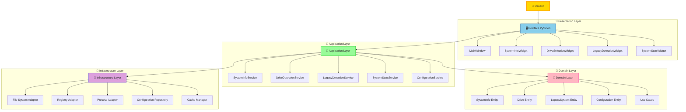
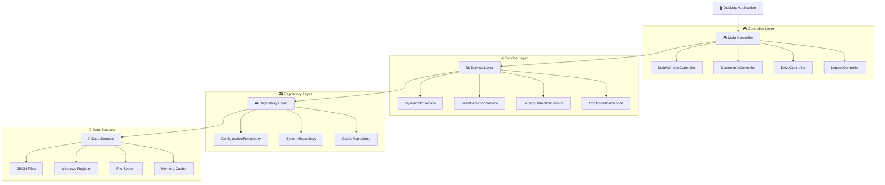
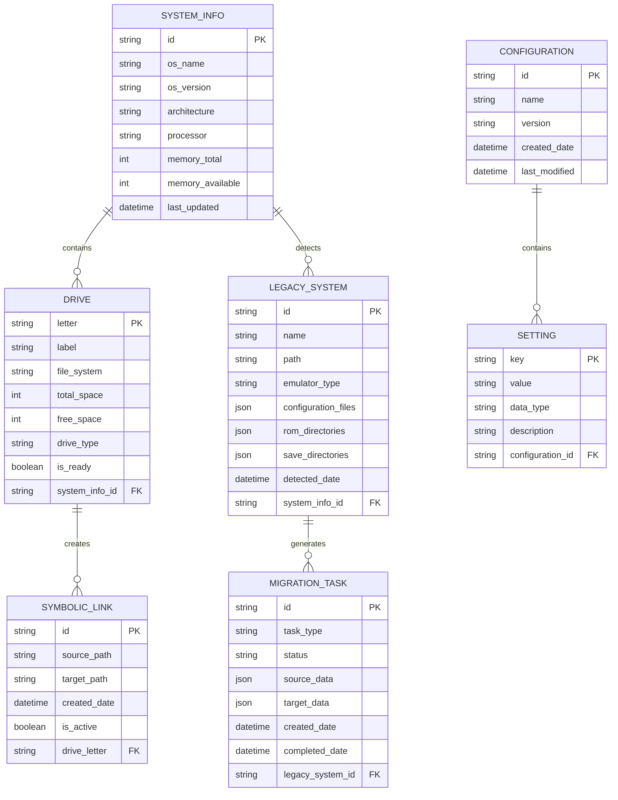

# 🏗️ FrontEmu-Tools - Arquitetura Técnica

## 1. Arquitetura de Design



## 2. Descrição das Tecnologias

### Frontend
- **PySide6** (Qt6) - Framework de interface gráfica moderna
- **Python 3.9+** - Linguagem principal do projeto
- **asyncio** - Programação assíncrona para operações não-bloqueantes

### Backend/Core
- **Clean Architecture** - Padrão arquitetural para separação de responsabilidades
- **Dependency Injection** - Inversão de controle para baixo acoplamento
- **Repository Pattern** - Abstração de acesso a dados

### Infraestrutura
- **JSON/XML** - Formatos de configuração e dados
- **Windows Registry** - Detecção de sistemas legados
- **File System** - Operações de arquivo e links simbólicos

## 3. Definições de Rotas (Interface)

| Rota/Widget | Propósito |
|-------------|-----------|
| `/main` | Janela principal com navegação entre módulos |
| `/system-info` | Exibição de informações do sistema |
| `/drive-selection` | Seleção e configuração de drives |
| `/legacy-detection` | Detecção e migração de sistemas legados |
| `/system-stats` | Monitoramento em tempo real do sistema |
| `/configuration` | Configurações gerais da aplicação |

## 4. Definições de API (Serviços Internos)

### 4.1 Core Services

**SystemInfoService**
```python
class SystemInfoService:
    """Serviço para coleta de informações do sistema"""
    
    async def get_system_info() -> SystemInfo:
        """Retorna informações completas do sistema"""
        pass
    
    async def get_hardware_info() -> HardwareInfo:
        """Retorna informações de hardware"""
        pass
    
    async def get_os_info() -> OSInfo:
        """Retorna informações do sistema operacional"""
        pass
```

**DriveDetectionService**
```python
class DriveDetectionService:
    """Serviço para detecção e gerenciamento de drives"""
    
    async def detect_drives() -> List[Drive]:
        """Detecta todos os drives disponíveis"""
        pass
    
    async def analyze_drive(drive_path: str) -> DriveAnalysis:
        """Analisa um drive específico"""
        pass
    
    async def create_symbolic_links(source: str, target: str) -> bool:
        """Cria links simbólicos entre diretórios"""
        pass
```

**LegacyDetectionService**
```python
class LegacyDetectionService:
    """Serviço para detecção de sistemas legados"""
    
    async def scan_legacy_systems() -> List[LegacySystem]:
        """Escaneia sistemas de emulação existentes"""
        pass
    
    async def migrate_legacy_system(system: LegacySystem) -> MigrationResult:
        """Migra sistema legado para nova estrutura"""
        pass
    
    async def validate_migration(system: LegacySystem) -> ValidationResult:
        """Valida migração realizada"""
        pass
```

### 4.2 Tipos de Dados

**SystemInfo**
```python
@dataclass
class SystemInfo:
    os_name: str
    os_version: str
    architecture: str
    processor: str
    memory_total: int
    memory_available: int
    disk_usage: Dict[str, DiskUsage]
    timestamp: datetime
```

**Drive**
```python
@dataclass
class Drive:
    letter: str
    label: str
    file_system: str
    total_space: int
    free_space: int
    drive_type: DriveType
    is_ready: bool
```

**LegacySystem**
```python
@dataclass
class LegacySystem:
    name: str
    path: str
    emulator_type: EmulatorType
    configuration_files: List[str]
    rom_directories: List[str]
    save_directories: List[str]
    detected_date: datetime
```

## 5. Arquitetura do Servidor (Aplicação Desktop)



## 6. Modelo de Dados

### 6.1 Definição do Modelo de Dados



### 6.2 Linguagem de Definição de Dados (DDL)

**Configuração Principal**
```json
{
  "application": {
    "name": "FrontEmu-Tools",
    "version": "1.0.0",
    "settings": {
      "auto_detect_drives": true,
      "auto_scan_legacy": true,
      "cache_enabled": true,
      "cache_duration": 3600,
      "log_level": "INFO",
      "theme": "dark",
      "language": "pt-BR"
    }
  },
  "drives": {
    "base_drive": "C:",
    "target_drive": "D:",
    "symbolic_links": {
      "enabled": true,
      "auto_create": true,
      "backup_original": true
    }
  },
  "legacy_detection": {
    "scan_paths": [
      "C:\\Program Files",
      "C:\\Program Files (x86)",
      "C:\\Users\\%USERNAME%\\Documents"
    ],
    "emulator_patterns": {
      "retroarch": ["retroarch.exe", "retroarch.cfg"],
      "pcsx2": ["pcsx2.exe", "inis\\PCSX2.ini"],
      "dolphin": ["Dolphin.exe", "User\\Config\\Dolphin.ini"],
      "cemu": ["Cemu.exe", "settings.xml"]
    }
  }
}
```

**Cache de Sistema**
```json
{
  "cache": {
    "system_info": {
      "timestamp": "2025-01-15T10:30:00Z",
      "ttl": 3600,
      "data": {
        "os_name": "Windows 11",
        "os_version": "10.0.22631",
        "architecture": "x64",
        "processor": "Intel Core i7-12700K",
        "memory_total": 34359738368,
        "memory_available": 17179869184
      }
    },
    "drives": {
      "timestamp": "2025-01-15T10:30:00Z",
      "ttl": 1800,
      "data": [
        {
          "letter": "C:",
          "label": "Windows",
          "file_system": "NTFS",
          "total_space": 1000204886016,
          "free_space": 500102443008,
          "drive_type": "Fixed",
          "is_ready": true
        },
        {
          "letter": "D:",
          "label": "Games",
          "file_system": "NTFS",
          "total_space": 2000409772032,
          "free_space": 1500307329024,
          "drive_type": "Fixed",
          "is_ready": true
        }
      ]
    }
  }
}
```

**Configuração de Links Simbólicos**
```json
{
  "symbolic_links": [
    {
      "id": "retroarch_roms",
      "source_path": "C:\\RetroArch\\roms",
      "target_path": "D:\\Emulation\\ROMs",
      "created_date": "2025-01-15T10:30:00Z",
      "is_active": true,
      "backup_path": "C:\\RetroArch\\roms.backup"
    },
    {
      "id": "pcsx2_saves",
      "source_path": "C:\\PCSX2\\memcards",
      "target_path": "D:\\Emulation\\Saves\\PCSX2",
      "created_date": "2025-01-15T10:35:00Z",
      "is_active": true,
      "backup_path": "C:\\PCSX2\\memcards.backup"
    }
  ]
}
```

**Dados de Sistemas Legados Detectados**
```json
{
  "legacy_systems": [
    {
      "id": "retroarch_001",
      "name": "RetroArch",
      "path": "C:\\RetroArch",
      "emulator_type": "multi_system",
      "configuration_files": [
        "C:\\RetroArch\\retroarch.cfg",
        "C:\\RetroArch\\config\\*.cfg"
      ],
      "rom_directories": [
        "C:\\RetroArch\\roms"
      ],
      "save_directories": [
        "C:\\RetroArch\\saves",
        "C:\\RetroArch\\states"
      ],
      "detected_date": "2025-01-15T10:30:00Z",
      "migration_status": "pending"
    },
    {
      "id": "pcsx2_001",
      "name": "PCSX2",
      "path": "C:\\PCSX2",
      "emulator_type": "playstation2",
      "configuration_files": [
        "C:\\PCSX2\\inis\\PCSX2.ini",
        "C:\\PCSX2\\inis\\*.ini"
      ],
      "rom_directories": [
        "C:\\PCSX2\\games"
      ],
      "save_directories": [
        "C:\\PCSX2\\memcards",
        "C:\\PCSX2\\sstates"
      ],
      "detected_date": "2025-01-15T10:32:00Z",
      "migration_status": "completed"
    }
  ]
}
```

---

## 🔧 Implementação Técnica

### Padrões de Design Utilizados

1. **Clean Architecture** - Separação clara de responsabilidades
2. **Repository Pattern** - Abstração de acesso a dados
3. **Dependency Injection** - Inversão de controle
4. **Observer Pattern** - Notificações de mudanças de estado
5. **Command Pattern** - Encapsulamento de operações
6. **Factory Pattern** - Criação de objetos complexos

### Princípios SOLID Aplicados

- **S** - Single Responsibility: Cada classe tem uma única responsabilidade
- **O** - Open/Closed: Aberto para extensão, fechado para modificação
- **L** - Liskov Substitution: Subtipos devem ser substituíveis
- **I** - Interface Segregation: Interfaces específicas e coesas
- **D** - Dependency Inversion: Dependência de abstrações, não implementações

### Estrutura de Diretórios Técnica

```
FrontEmu-Tools/
├── 🏢 domain/                    # Camada de Domínio
│   ├── entities/                 # Entidades de negócio
│   ├── use_cases/               # Casos de uso
│   └── interfaces/              # Contratos/Interfaces
├── 📱 application/               # Camada de Aplicação
│   ├── services/                # Serviços de aplicação
│   ├── dtos/                    # Data Transfer Objects
│   └── mappers/                 # Mapeadores de dados
├── 🔧 infrastructure/            # Camada de Infraestrutura
│   ├── adapters/                # Adaptadores externos
│   ├── repositories/            # Implementações de repositórios
│   └── external/                # Serviços externos
├── 🎨 presentation/              # Camada de Apresentação
│   ├── widgets/                 # Componentes de UI
│   ├── controllers/             # Controladores de UI
│   └── styles/                  # Estilos e temas
├── 🧪 tests/                     # Testes automatizados
│   ├── unit/                    # Testes unitários
│   ├── integration/             # Testes de integração
│   └── e2e/                     # Testes end-to-end
└── 📋 docs/                      # Documentação técnica
```

Esta arquitetura técnica garante:
- ✅ **Manutenibilidade** através de código limpo e bem estruturado
- ✅ **Testabilidade** com separação clara de responsabilidades
- ✅ **Extensibilidade** através de interfaces bem definidas
- ✅ **Performance** com cache inteligente e operações assíncronas
- ✅ **Confiabilidade** com tratamento robusto de erros