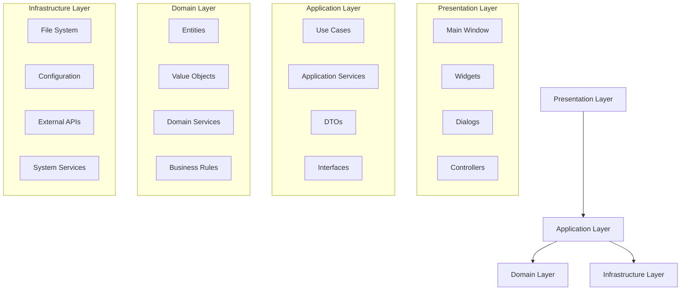
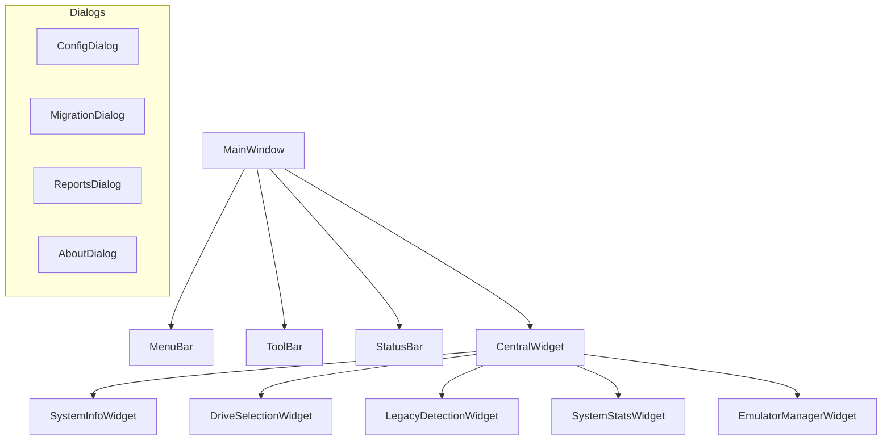

# Documento de Design Técnico
## FrontEmu-Tools v1.0

### Informações do Documento
- **Projeto**: FrontEmu-Tools
- **Versão**: 1.0
- **Data**: Janeiro 2025
- **Autor**: Equipe de Arquitetura FrontEmu-Tools
- **Status**: Em Desenvolvimento

---

## 1. Visão Geral da Arquitetura

### 1.1 Princípios Arquiteturais
O FrontEmu-Tools segue os princípios da **Clean Architecture**, garantindo:
- **Separação de Responsabilidades**: Cada camada tem uma responsabilidade específica
- **Inversão de Dependências**: Camadas internas não dependem de camadas externas
- **Testabilidade**: Código facilmente testável através de interfaces
- **Manutenibilidade**: Estrutura modular e extensível

### 1.2 Arquitetura em Camadas



---

## 2. Tecnologias e Frameworks

### 2.1 Stack Tecnológico
- **Linguagem**: Python 3.9+
- **GUI Framework**: PySide6 (Qt6)
- **Arquitetura**: Clean Architecture
- **Testes**: pytest, pytest-qt, pytest-cov
- **Qualidade**: mypy, ruff, black
- **Documentação**: Sphinx
- **Versionamento**: Git

### 2.2 Dependências Principais
```python
# requirements.txt
PySide6==6.8.0
pytest==8.3.0
pytest-qt==4.4.0
pytest-cov==5.0.0
mypy==1.11.0
ruff==0.6.0
black==24.8.0
psutil==5.9.0
requests==2.31.0
```

### 2.3 Estrutura de Diretórios
```
FrontEmu-Tools/
├── src/
│   ├── frontemutools/
│   │   ├── presentation/
│   │   │   ├── gui/
│   │   │   │   ├── main_window.py
│   │   │   │   ├── widgets/
│   │   │   │   └── dialogs/
│   │   │   └── controllers/
│   │   ├── application/
│   │   │   ├── use_cases/
│   │   │   ├── services/
│   │   │   └── interfaces/
│   │   ├── domain/
│   │   │   ├── entities/
│   │   │   ├── value_objects/
│   │   │   └── services/
│   │   └── infrastructure/
│   │       ├── file_system/
│   │       ├── configuration/
│   │       └── system/
│   └── main.py
├── tests/
├── docs/
├── assets/
└── config/
```

---

## 3. Camada de Apresentação (Presentation Layer)

### 3.1 Arquitetura da GUI



### 3.2 Componentes Principais

#### 3.2.1 MainWindow
```python
class MainWindow(QMainWindow):
    """Janela principal da aplicação."""
    
    def __init__(self, container: ApplicationContainer):
        super().__init__()
        self._container = container
        self._setup_ui()
        self._connect_signals()
    
    def _setup_ui(self) -> None:
        """Configura a interface do usuário."""
        pass
    
    def _connect_signals(self) -> None:
        """Conecta sinais e slots."""
        pass
```

#### 3.2.2 SystemInfoWidget
```python
class SystemInfoWidget(QWidget):
    """Widget para exibição de informações do sistema."""
    
    def __init__(self, system_service: SystemInfoService):
        super().__init__()
        self._system_service = system_service
        self._setup_ui()
    
    def refresh_system_info(self) -> None:
        """Atualiza informações do sistema."""
        info = self._system_service.get_system_info()
        self._update_display(info)
```

### 3.3 Padrões de Design na GUI

#### 3.3.1 Model-View-Controller (MVC)
- **Model**: Entidades de domínio
- **View**: Widgets Qt
- **Controller**: Controllers de aplicação

#### 3.3.2 Observer Pattern
```python
class SystemStatsWidget(QWidget):
    """Widget que observa mudanças nas estatísticas do sistema."""
    
    def __init__(self, stats_service: SystemStatsService):
        super().__init__()
        self._stats_service = stats_service
        self._stats_service.stats_updated.connect(self._on_stats_updated)
    
    def _on_stats_updated(self, stats: SystemStats) -> None:
        """Callback para atualização de estatísticas."""
        self._update_charts(stats)
```

---

## 4. Camada de Aplicação (Application Layer)

### 4.1 Use Cases

#### 4.1.1 DetectLegacyInstallationsUseCase
```python
class DetectLegacyInstallationsUseCase:
    """Caso de uso para detecção de instalações legadas."""
    
    def __init__(
        self,
        legacy_service: LegacyDetectionService,
        file_system: FileSystemInterface
    ):
        self._legacy_service = legacy_service
        self._file_system = file_system
    
    def execute(self, drive_path: str) -> List[LegacyInstallation]:
        """Executa a detecção de instalações legadas."""
        return self._legacy_service.scan_for_legacy_installations(drive_path)
```

#### 4.1.2 MigrateToSDStructureUseCase
```python
class MigrateToSDStructureUseCase:
    """Caso de uso para migração para estrutura SD."""
    
    def __init__(
        self,
        migration_service: MigrationService,
        backup_service: BackupService,
        validation_service: ValidationService
    ):
        self._migration_service = migration_service
        self._backup_service = backup_service
        self._validation_service = validation_service
    
    def execute(self, request: MigrationRequest) -> MigrationResult:
        """Executa a migração para estrutura SD."""
        # 1. Criar backup
        backup_path = self._backup_service.create_backup(request.source_path)
        
        # 2. Executar migração
        result = self._migration_service.migrate(request)
        
        # 3. Validar resultado
        validation = self._validation_service.validate_structure(request.target_path)
        
        return MigrationResult(
            success=result.success,
            backup_path=backup_path,
            validation=validation
        )
```

### 4.2 Application Services

#### 4.2.1 SystemInfoApplicationService
```python
class SystemInfoApplicationService:
    """Serviço de aplicação para informações do sistema."""
    
    def __init__(
        self,
        system_info_service: SystemInfoService,
        drive_manager_service: DriveManagerService
    ):
        self._system_info_service = system_info_service
        self._drive_manager_service = drive_manager_service
    
    def get_system_overview(self) -> SystemOverviewDTO:
        """Obtém visão geral do sistema."""
        system_info = self._system_info_service.get_system_info()
        drives_info = self._drive_manager_service.get_all_drives_info()
        
        return SystemOverviewDTO(
            system_info=system_info,
            drives_info=drives_info
        )
```

### 4.3 DTOs (Data Transfer Objects)

```python
@dataclass
class SystemOverviewDTO:
    """DTO para visão geral do sistema."""
    system_info: SystemInfo
    drives_info: List[DriveInfo]

@dataclass
class MigrationRequestDTO:
    """DTO para solicitação de migração."""
    source_path: str
    target_path: str
    backup_enabled: bool
    dry_run: bool

@dataclass
class ValidationResultDTO:
    """DTO para resultado de validação."""
    is_valid: bool
    errors: List[str]
    warnings: List[str]
    info_messages: List[str]
```

---

## 5. Camada de Domínio (Domain Layer)

### 5.1 Entidades

#### 5.1.1 EmulatorInstallation
```python
class EmulatorInstallation:
    """Entidade representando uma instalação de emulador."""
    
    def __init__(
        self,
        id: EmulatorId,
        name: str,
        version: Version,
        platform: Platform,
        installation_path: Path,
        configuration: EmulatorConfiguration
    ):
        self._id = id
        self._name = name
        self._version = version
        self._platform = platform
        self._installation_path = installation_path
        self._configuration = configuration
    
    def is_compatible_with(self, platform: Platform) -> bool:
        """Verifica compatibilidade com plataforma."""
        return self._platform.is_compatible_with(platform)
    
    def update_configuration(self, config: EmulatorConfiguration) -> None:
        """Atualiza configuração do emulador."""
        if not config.is_valid():
            raise InvalidConfigurationError("Configuração inválida")
        self._configuration = config
```

#### 5.1.2 LegacyInstallation
```python
class LegacyInstallation:
    """Entidade representando uma instalação legada."""
    
    def __init__(
        self,
        id: InstallationId,
        type: LegacyType,
        path: Path,
        detected_emulators: List[EmulatorInstallation],
        conflicts: List[Conflict]
    ):
        self._id = id
        self._type = type
        self._path = path
        self._detected_emulators = detected_emulators
        self._conflicts = conflicts
    
    def has_conflicts(self) -> bool:
        """Verifica se há conflitos na instalação."""
        return len(self._conflicts) > 0
    
    def can_be_migrated(self) -> bool:
        """Verifica se pode ser migrada."""
        return not self.has_critical_conflicts()
```

### 5.2 Value Objects

```python
@dataclass(frozen=True)
class Version:
    """Value object para versão."""
    major: int
    minor: int
    patch: int
    
    def __str__(self) -> str:
        return f"{self.major}.{self.minor}.{self.patch}"
    
    def is_newer_than(self, other: 'Version') -> bool:
        """Verifica se é mais nova que outra versão."""
        return (self.major, self.minor, self.patch) > (other.major, other.minor, other.patch)

@dataclass(frozen=True)
class Path:
    """Value object para caminhos."""
    value: str
    
    def __post_init__(self):
        if not self.value:
            raise ValueError("Path cannot be empty")
    
    def exists(self) -> bool:
        """Verifica se o caminho existe."""
        return os.path.exists(self.value)
    
    def is_directory(self) -> bool:
        """Verifica se é um diretório."""
        return os.path.isdir(self.value)
```

### 5.3 Domain Services

```python
class MigrationDomainService:
    """Serviço de domínio para migração."""
    
    def calculate_migration_plan(
        self,
        legacy_installation: LegacyInstallation,
        target_structure: SDStructure
    ) -> MigrationPlan:
        """Calcula plano de migração."""
        plan = MigrationPlan()
        
        for emulator in legacy_installation.detected_emulators:
            target_path = target_structure.get_emulator_path(emulator.platform)
            plan.add_step(MigrationStep(
                source=emulator.installation_path,
                target=target_path,
                type=MigrationStepType.MOVE_DIRECTORY
            ))
        
        return plan
    
    def validate_migration_feasibility(
        self,
        plan: MigrationPlan,
        available_space: int
    ) -> ValidationResult:
        """Valida viabilidade da migração."""
        required_space = plan.calculate_required_space()
        
        if required_space > available_space:
            return ValidationResult.failure(
                f"Espaço insuficiente: {required_space} necessário, {available_space} disponível"
            )
        
        return ValidationResult.success()
```

---

## 6. Camada de Infraestrutura (Infrastructure Layer)

### 6.1 File System

```python
class WindowsFileSystemAdapter(FileSystemInterface):
    """Adaptador para sistema de arquivos Windows."""
    
    def read_file(self, path: str) -> str:
        """Lê arquivo do sistema."""
        try:
            with open(path, 'r', encoding='utf-8') as file:
                return file.read()
        except FileNotFoundError:
            raise FileNotFoundError(f"Arquivo não encontrado: {path}")
    
    def write_file(self, path: str, content: str) -> None:
        """Escreve arquivo no sistema."""
        os.makedirs(os.path.dirname(path), exist_ok=True)
        with open(path, 'w', encoding='utf-8') as file:
            file.write(content)
    
    def list_directory(self, path: str) -> List[str]:
        """Lista conteúdo do diretório."""
        return os.listdir(path)
    
    def get_drive_info(self, drive: str) -> DriveInfo:
        """Obtém informações do drive."""
        usage = shutil.disk_usage(drive)
        return DriveInfo(
            letter=drive,
            total_space=usage.total,
            free_space=usage.free,
            used_space=usage.used
        )
```

### 6.2 Configuration

```python
class JsonConfigurationRepository(ConfigurationRepositoryInterface):
    """Repositório de configuração baseado em JSON."""
    
    def __init__(self, file_system: FileSystemInterface):
        self._file_system = file_system
    
    def load_configuration(self, config_name: str) -> Configuration:
        """Carrega configuração do arquivo."""
        content = self._file_system.read_file(f"config/{config_name}.json")
        data = json.loads(content)
        return Configuration.from_dict(data)
    
    def save_configuration(self, config_name: str, configuration: Configuration) -> None:
        """Salva configuração no arquivo."""
        content = json.dumps(configuration.to_dict(), indent=2)
        self._file_system.write_file(f"config/{config_name}.json", content)
```

### 6.3 System Services

```python
class WindowsSystemService(SystemServiceInterface):
    """Serviço de sistema para Windows."""
    
    def get_system_info(self) -> SystemInfo:
        """Obtém informações do sistema."""
        return SystemInfo(
            os_name=platform.system(),
            os_version=platform.version(),
            cpu_count=psutil.cpu_count(),
            total_memory=psutil.virtual_memory().total,
            architecture=platform.architecture()[0]
        )
    
    def get_running_processes(self) -> List[ProcessInfo]:
        """Obtém processos em execução."""
        processes = []
        for proc in psutil.process_iter(['pid', 'name', 'cpu_percent', 'memory_percent']):
            processes.append(ProcessInfo(
                pid=proc.info['pid'],
                name=proc.info['name'],
                cpu_percent=proc.info['cpu_percent'],
                memory_percent=proc.info['memory_percent']
            ))
        return processes
```

---

## 7. Injeção de Dependências

### 7.1 Container de Aplicação

```python
class ApplicationContainer:
    """Container de injeção de dependências."""
    
    def __init__(self):
        self._services = {}
        self._setup_services()
    
    def _setup_services(self) -> None:
        """Configura serviços no container."""
        # Infrastructure
        self._services['file_system'] = WindowsFileSystemAdapter()
        self._services['system_service'] = WindowsSystemService()
        self._services['config_repository'] = JsonConfigurationRepository(
            self._services['file_system']
        )
        
        # Domain Services
        self._services['migration_domain_service'] = MigrationDomainService()
        
        # Application Services
        self._services['system_info_service'] = SystemInfoApplicationService(
            self._services['system_service'],
            self._services['file_system']
        )
        
        # Use Cases
        self._services['detect_legacy_use_case'] = DetectLegacyInstallationsUseCase(
            self._services['legacy_detection_service'],
            self._services['file_system']
        )
    
    def get_service(self, service_name: str) -> Any:
        """Obtém serviço do container."""
        if service_name not in self._services:
            raise ServiceNotFoundError(f"Serviço não encontrado: {service_name}")
        return self._services[service_name]
```

---

## 8. Tratamento de Erros

### 8.1 Hierarquia de Exceções

```python
class FrontEmuToolsError(Exception):
    """Exceção base da aplicação."""
    pass

class DomainError(FrontEmuToolsError):
    """Erro de domínio."""
    pass

class ApplicationError(FrontEmuToolsError):
    """Erro de aplicação."""
    pass

class InfrastructureError(FrontEmuToolsError):
    """Erro de infraestrutura."""
    pass

# Exceções específicas
class InvalidConfigurationError(DomainError):
    """Configuração inválida."""
    pass

class MigrationFailedError(ApplicationError):
    """Falha na migração."""
    pass

class FileSystemError(InfrastructureError):
    """Erro no sistema de arquivos."""
    pass
```

### 8.2 Error Handler Global

```python
class GlobalErrorHandler:
    """Manipulador global de erros."""
    
    def __init__(self, logger: Logger):
        self._logger = logger
    
    def handle_error(self, error: Exception) -> None:
        """Manipula erro global."""
        if isinstance(error, DomainError):
            self._handle_domain_error(error)
        elif isinstance(error, ApplicationError):
            self._handle_application_error(error)
        elif isinstance(error, InfrastructureError):
            self._handle_infrastructure_error(error)
        else:
            self._handle_unexpected_error(error)
    
    def _handle_domain_error(self, error: DomainError) -> None:
        """Manipula erro de domínio."""
        self._logger.warning(f"Erro de domínio: {error}")
        # Exibir mensagem amigável ao usuário
    
    def _handle_infrastructure_error(self, error: InfrastructureError) -> None:
        """Manipula erro de infraestrutura."""
        self._logger.error(f"Erro de infraestrutura: {error}")
        # Tentar recuperação automática
```

---

## 9. Logging e Monitoramento

### 9.1 Sistema de Logging

```python
class LoggingConfiguration:
    """Configuração do sistema de logging."""
    
    @staticmethod
    def setup_logging() -> None:
        """Configura sistema de logging."""
        logging.basicConfig(
            level=logging.INFO,
            format='%(asctime)s - %(name)s - %(levelname)s - %(message)s',
            handlers=[
                logging.FileHandler('logs/frontemutools.log'),
                logging.StreamHandler()
            ]
        )
        
        # Configurar rotação de logs
        file_handler = RotatingFileHandler(
            'logs/frontemutools.log',
            maxBytes=10*1024*1024,  # 10MB
            backupCount=5
        )
        file_handler.setFormatter(
            logging.Formatter('%(asctime)s - %(name)s - %(levelname)s - %(message)s')
        )
```

### 9.2 Performance Monitoring

```python
class PerformanceMonitor:
    """Monitor de performance da aplicação."""
    
    def __init__(self):
        self._metrics = {}
    
    def start_timer(self, operation: str) -> None:
        """Inicia timer para operação."""
        self._metrics[operation] = time.time()
    
    def end_timer(self, operation: str) -> float:
        """Finaliza timer e retorna duração."""
        if operation not in self._metrics:
            raise ValueError(f"Timer não iniciado para: {operation}")
        
        duration = time.time() - self._metrics[operation]
        del self._metrics[operation]
        
        logger.info(f"Operação '{operation}' executada em {duration:.2f}s")
        return duration
    
    @contextmanager
    def measure_time(self, operation: str):
        """Context manager para medição de tempo."""
        self.start_timer(operation)
        try:
            yield
        finally:
            self.end_timer(operation)
```

---

## 10. Testes

### 10.1 Estratégia de Testes

```python
# Teste de Unidade
class TestMigrationDomainService(unittest.TestCase):
    """Testes para serviço de domínio de migração."""
    
    def setUp(self):
        self.service = MigrationDomainService()
    
    def test_calculate_migration_plan_success(self):
        """Testa cálculo de plano de migração com sucesso."""
        # Arrange
        legacy_installation = self._create_legacy_installation()
        target_structure = self._create_target_structure()
        
        # Act
        plan = self.service.calculate_migration_plan(
            legacy_installation, 
            target_structure
        )
        
        # Assert
        self.assertIsNotNone(plan)
        self.assertGreater(len(plan.steps), 0)

# Teste de Integração
class TestSystemInfoIntegration(unittest.TestCase):
    """Testes de integração para informações do sistema."""
    
    def test_get_system_overview_integration(self):
        """Testa obtenção de visão geral do sistema."""
        # Arrange
        container = ApplicationContainer()
        service = container.get_service('system_info_service')
        
        # Act
        overview = service.get_system_overview()
        
        # Assert
        self.assertIsNotNone(overview.system_info)
        self.assertIsNotNone(overview.drives_info)

# Teste de GUI
class TestMainWindowGUI(QTestCase):
    """Testes de GUI para janela principal."""
    
    def test_main_window_initialization(self):
        """Testa inicialização da janela principal."""
        # Arrange
        container = ApplicationContainer()
        
        # Act
        window = MainWindow(container)
        
        # Assert
        self.assertIsNotNone(window)
        self.assertTrue(window.isVisible())
```

### 10.2 Cobertura de Testes

- **Unidade**: > 80% de cobertura
- **Integração**: Cenários críticos
- **GUI**: Fluxos principais
- **E2E**: Casos de uso completos

---

## 11. Deployment e Distribuição

### 11.1 Build Process

```python
# build.py
import subprocess
import shutil
import os

def build_application():
    """Constrói aplicação para distribuição."""
    
    # 1. Executar testes
    result = subprocess.run(['pytest', 'tests/'], capture_output=True)
    if result.returncode != 0:
        raise Exception("Testes falharam")
    
    # 2. Verificar qualidade do código
    subprocess.run(['mypy', 'src/'], check=True)
    subprocess.run(['ruff', 'check', 'src/'], check=True)
    
    # 3. Criar executável
    subprocess.run([
        'pyinstaller',
        '--onefile',
        '--windowed',
        '--name', 'FrontEmuTools',
        'src/main.py'
    ], check=True)
    
    # 4. Copiar recursos
    shutil.copytree('assets/', 'dist/assets/')
    shutil.copytree('config/', 'dist/config/')
    
    print("Build concluído com sucesso!")

if __name__ == '__main__':
    build_application()
```

### 11.2 Instalador

```nsis
; installer.nsi
!define APP_NAME "FrontEmu-Tools"
!define APP_VERSION "1.0.0"
!define APP_PUBLISHER "FrontEmu-Tools Team"

Name "${APP_NAME}"
OutFile "${APP_NAME}-${APP_VERSION}-Setup.exe"
InstallDir "$PROGRAMFILES\${APP_NAME}"

Section "MainSection" SEC01
    SetOutPath "$INSTDIR"
    File /r "dist\*.*"
    
    CreateDirectory "$SMPROGRAMS\${APP_NAME}"
    CreateShortCut "$SMPROGRAMS\${APP_NAME}\${APP_NAME}.lnk" "$INSTDIR\FrontEmuTools.exe"
    CreateShortCut "$DESKTOP\${APP_NAME}.lnk" "$INSTDIR\FrontEmuTools.exe"
    
    WriteRegStr HKLM "Software\Microsoft\Windows\CurrentVersion\Uninstall\${APP_NAME}" "DisplayName" "${APP_NAME}"
    WriteRegStr HKLM "Software\Microsoft\Windows\CurrentVersion\Uninstall\${APP_NAME}" "UninstallString" "$INSTDIR\uninstall.exe"
    
    WriteUninstaller "$INSTDIR\uninstall.exe"
SectionEnd
```

---

## 12. Considerações de Segurança

### 12.1 Validação de Entrada
- Sanitização de paths de arquivo
- Validação de configurações
- Verificação de permissões

### 12.2 Proteção de Dados
- Backup automático antes de operações críticas
- Verificação de integridade de arquivos
- Logs de auditoria

### 12.3 Princípio do Menor Privilégio
- Execução com permissões mínimas necessárias
- Validação de operações privilegiadas
- Isolamento de componentes críticos

---

## 13. Performance e Otimização

### 13.1 Otimizações de Performance
- **Lazy Loading**: Carregamento sob demanda
- **Caching**: Cache inteligente de dados
- **Async Operations**: Operações assíncronas para I/O
- **Memory Management**: Gerenciamento eficiente de memória

### 13.2 Métricas de Performance
- Tempo de inicialização < 10s
- Tempo de resposta da UI < 2s
- Uso de memória < 512MB
- CPU usage < 20% em idle

---

## 14. Manutenibilidade

### 14.1 Padrões de Código
- **SOLID Principles**: Aplicação rigorosa
- **Clean Code**: Código limpo e legível
- **Documentation**: Documentação abrangente
- **Testing**: Cobertura de testes adequada

### 14.2 Versionamento
- **Semantic Versioning**: MAJOR.MINOR.PATCH
- **Git Flow**: Fluxo de desenvolvimento estruturado
- **Release Notes**: Documentação de mudanças
- **Migration Guides**: Guias de migração entre versões

---

**Documento aprovado por**: Equipe de Arquitetura FrontEmu-Tools
**Data de aprovação**: Janeiro 2025
**Próxima revisão**: Março 2025