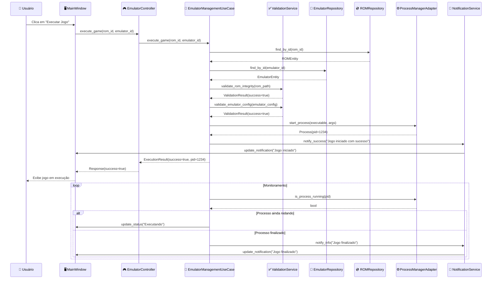
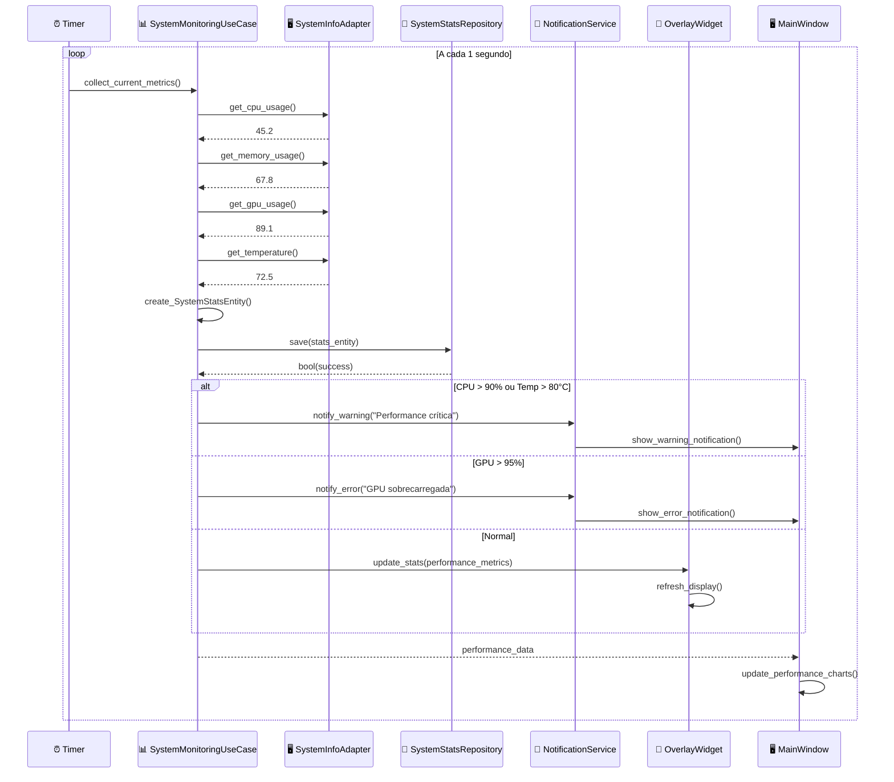
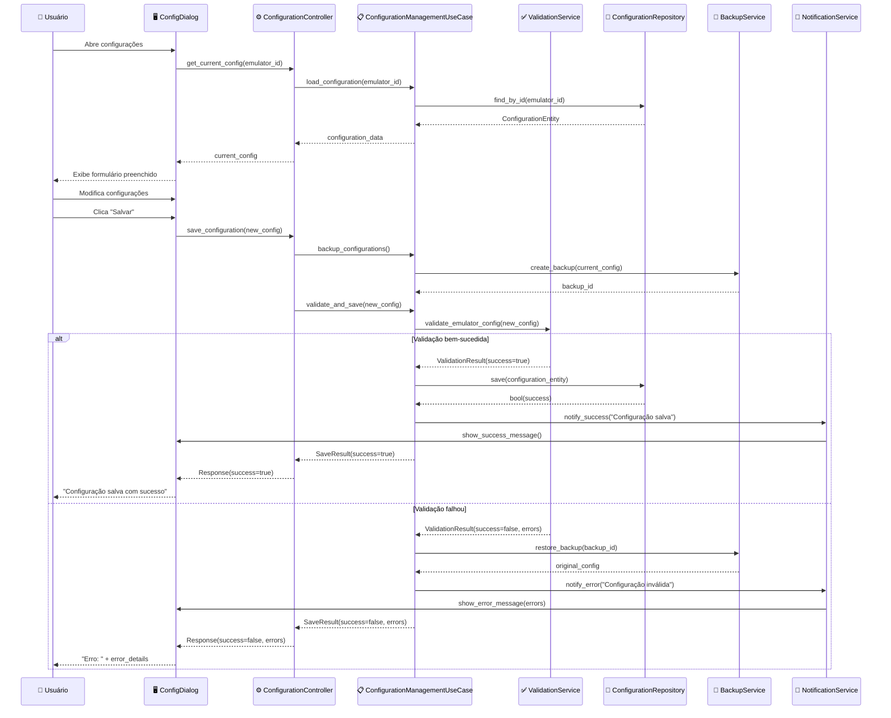
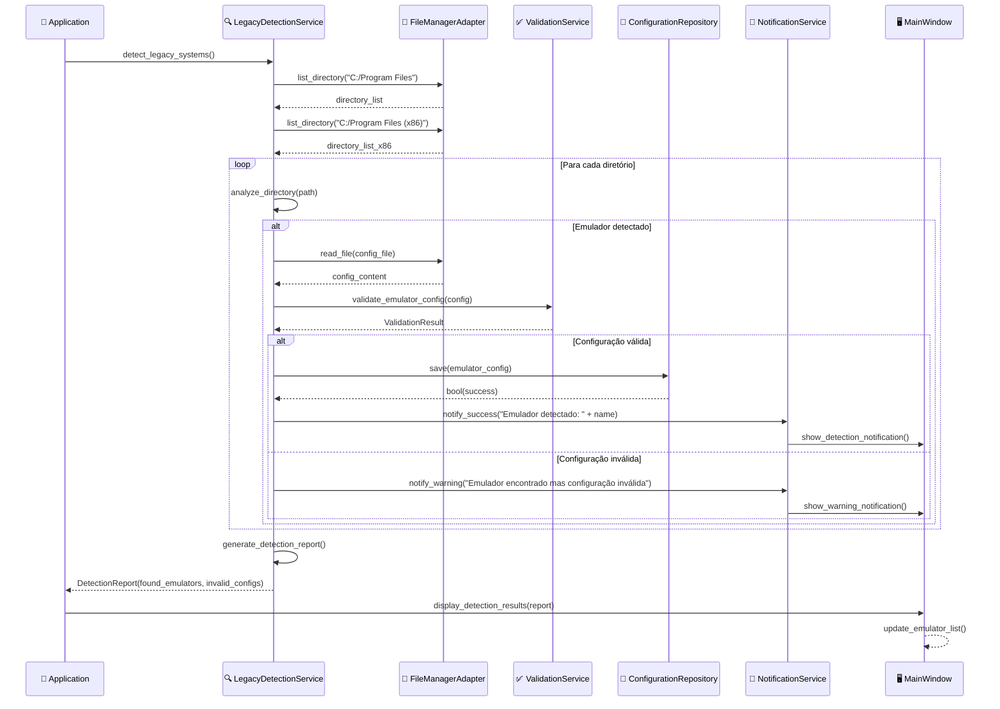
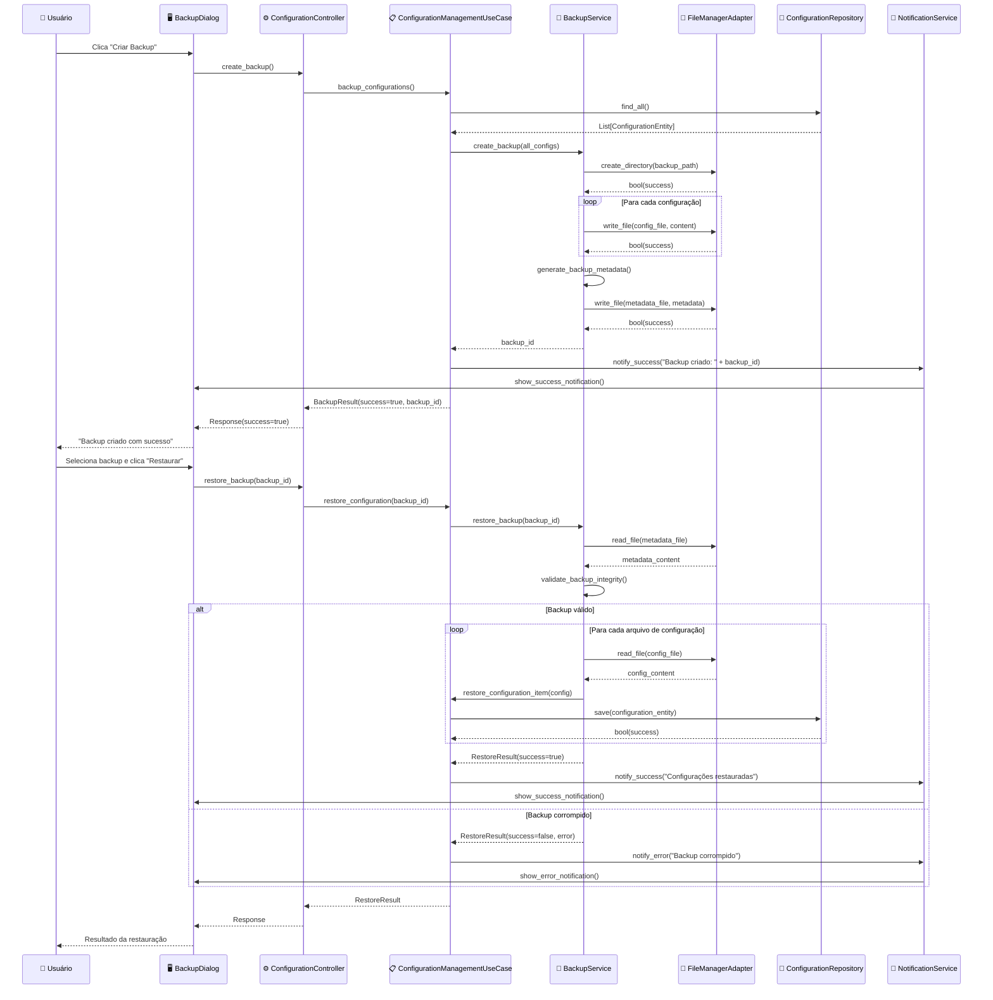

# Diagramas de Sequência - FrontEmu-Tools

## Visão Geral
Este documento contém os principais diagramas de sequência que ilustram as interações entre os componentes do FrontEmu-Tools.

## 1. Sequência: Executar Jogo

## 2. Sequência: Monitoramento de Performance

## 3. Sequência: Configuração de Emulador

## 4. Sequência: Detecção de Sistema Legacy

## 5. Sequência: Backup e Restauração

## Padrões de Interação

### 1. Validação Consistente
- Todas as operações críticas passam por validação
- Rollback automático em caso de falha

### 2. Notificações Assíncronas
- Sistema de notificações não bloqueia operações
- Feedback visual imediato para o usuário

### 3. Tratamento de Erro
- Cada operação tem tratamento específico de erro
- Logs detalhados para debugging

### 4. Monitoramento Contínuo
- Coleta periódica de métricas
- Alertas baseados em thresholds

### 5. Backup Automático
- Backup antes de operações críticas
- Restauração automática em caso de falha

## Considerações de Performance

1. **Operações Assíncronas**: Operações longas não bloqueiam a UI
2. **Caching**: Dados frequentemente acessados são cached
3. **Lazy Loading**: Carregamento sob demanda
4. **Pooling**: Reutilização de recursos quando possível
5. **Throttling**: Limitação de frequência para operações intensivas