# Diagrama de Casos de Uso - FrontEmu-Tools

## Visão Geral
Este diagrama representa os principais casos de uso do FrontEmu-Tools e as interações entre os diferentes tipos de usuários e o sistema.

## Diagrama de Casos de Uso

```mermaid
graph TB
    %% Atores
    User[👤 Usuário Final]
    Admin[👨‍💼 Administrador]
    Developer[👨‍💻 Desenvolvedor]
    System[🖥️ Sistema Operacional]

    %% Casos de Uso Principais
    subgraph "Gerenciamento de Emulação"
        UC1[Configurar Emulador]
        UC2[Executar Jogo]
        UC3[Gerenciar ROMs]
        UC4[Salvar Estado]
        UC5[Carregar Estado]
        UC6[Capturar Screenshot]
    end

    subgraph "Monitoramento do Sistema"
        UC7[Monitorar Performance]
        UC8[Visualizar Estatísticas]
        UC9[Gerar Relatórios]
        UC10[Configurar Alertas]
    end

    subgraph "Gerenciamento de Configuração"
        UC11[Configurar Paths]
        UC12[Gerenciar Perfis]
        UC13[Backup Configurações]
        UC14[Restaurar Configurações]
    end

    subgraph "Interface e Overlay"
        UC15[Personalizar Interface]
        UC16[Configurar Overlays]
        UC17[Gerenciar Temas]
        UC18[Configurar Hotkeys]
    end

    subgraph "Detecção e Validação"
        UC19[Detectar Sistemas Legacy]
        UC20[Validar Configurações]
        UC21[Verificar Integridade]
        UC22[Diagnosticar Problemas]
    end

    subgraph "Administração"
        UC23[Gerenciar Usuários]
        UC24[Configurar Permissões]
        UC25[Manter Sistema]
        UC26[Atualizar Software]
    end

    %% Relacionamentos Usuário Final
    User --> UC1
    User --> UC2
    User --> UC3
    User --> UC4
    User --> UC5
    User --> UC6
    User --> UC7
    User --> UC8
    User --> UC15
    User --> UC16
    User --> UC17
    User --> UC18

    %% Relacionamentos Administrador
    Admin --> UC9
    Admin --> UC10
    Admin --> UC11
    Admin --> UC12
    Admin --> UC13
    Admin --> UC14
    Admin --> UC23
    Admin --> UC24
    Admin --> UC25
    Admin --> UC26

    %% Relacionamentos Desenvolvedor
    Developer --> UC19
    Developer --> UC20
    Developer --> UC21
    Developer --> UC22

    %% Relacionamentos Sistema
    System --> UC7
    System --> UC8
    System --> UC19
    System --> UC21

    %% Extensões e Inclusões
    UC2 -.->|extends| UC4
    UC2 -.->|extends| UC5
    UC2 -.->|extends| UC6
    UC1 -.->|includes| UC20
    UC11 -.->|includes| UC20
    UC12 -.->|includes| UC13
    UC26 -.->|includes| UC13

    %% Estilos
    classDef userClass fill:#32CD32,stroke:#228B22,stroke-width:2px,color:#000
    classDef adminClass fill:#FFD700,stroke:#DAA520,stroke-width:2px,color:#000
    classDef devClass fill:#4A90E2,stroke:#2E5C8A,stroke-width:2px,color:#fff
    classDef systemClass fill:#FF6B6B,stroke:#E55555,stroke-width:2px,color:#fff
    classDef usecaseClass fill:#F0F8FF,stroke:#4682B4,stroke-width:1px,color:#000

    class User userClass
    class Admin adminClass
    class Developer devClass
    class System systemClass
    class UC1,UC2,UC3,UC4,UC5,UC6,UC7,UC8,UC9,UC10,UC11,UC12,UC13,UC14,UC15,UC16,UC17,UC18,UC19,UC20,UC21,UC22,UC23,UC24,UC25,UC26 usecaseClass
```

## Descrição dos Casos de Uso

### 1. Gerenciamento de Emulação

#### UC1 - Configurar Emulador
- **Ator**: Usuário Final
- **Descrição**: Configurar parâmetros do emulador (resolução, controles, áudio)
- **Pré-condições**: Sistema iniciado
- **Pós-condições**: Emulador configurado e pronto para uso

#### UC2 - Executar Jogo
- **Ator**: Usuário Final
- **Descrição**: Iniciar a execução de um jogo através do emulador
- **Pré-condições**: Emulador configurado, ROM disponível
- **Pós-condições**: Jogo em execução

#### UC3 - Gerenciar ROMs
- **Ator**: Usuário Final
- **Descrição**: Adicionar, remover e organizar ROMs na biblioteca
- **Pré-condições**: Sistema iniciado
- **Pós-condições**: Biblioteca de ROMs atualizada

### 2. Monitoramento do Sistema

#### UC7 - Monitorar Performance
- **Ator**: Usuário Final, Sistema
- **Descrição**: Acompanhar métricas de performance em tempo real
- **Pré-condições**: Sistema em execução
- **Pós-condições**: Métricas coletadas e exibidas

#### UC8 - Visualizar Estatísticas
- **Ator**: Usuário Final, Sistema
- **Descrição**: Exibir estatísticas históricas de uso e performance
- **Pré-condições**: Dados coletados disponíveis
- **Pós-condições**: Estatísticas apresentadas ao usuário

### 3. Interface e Overlay

#### UC15 - Personalizar Interface
- **Ator**: Usuário Final
- **Descrição**: Customizar aparência e layout da interface
- **Pré-condições**: Sistema iniciado
- **Pós-condições**: Interface personalizada aplicada

#### UC16 - Configurar Overlays
- **Ator**: Usuário Final
- **Descrição**: Configurar overlays de informação durante a emulação
- **Pré-condições**: Sistema iniciado
- **Pós-condições**: Overlays configurados

### 4. Administração

#### UC23 - Gerenciar Usuários
- **Ator**: Administrador
- **Descrição**: Criar, editar e remover contas de usuário
- **Pré-condições**: Privilégios administrativos
- **Pós-condições**: Usuários gerenciados

#### UC25 - Manter Sistema
- **Ator**: Administrador
- **Descrição**: Realizar manutenção preventiva e corretiva
- **Pré-condições**: Acesso administrativo
- **Pós-condições**: Sistema mantido e otimizado

## Relacionamentos

### Extends (Extensão)
- **UC2 extends UC4**: Executar jogo pode incluir salvar estado
- **UC2 extends UC5**: Executar jogo pode incluir carregar estado
- **UC2 extends UC6**: Executar jogo pode incluir capturar screenshot

### Includes (Inclusão)
- **UC1 includes UC20**: Configurar emulador sempre inclui validação
- **UC11 includes UC20**: Configurar paths sempre inclui validação
- **UC12 includes UC13**: Gerenciar perfis sempre inclui backup
- **UC26 includes UC13**: Atualizar software sempre inclui backup

## Prioridades

### Alta Prioridade
- UC1, UC2, UC3 (Funcionalidades core de emulação)
- UC7, UC8 (Monitoramento básico)
- UC20, UC21 (Validação e integridade)

### Média Prioridade
- UC4, UC5, UC6 (Funcionalidades avançadas de emulação)
- UC15, UC16, UC17 (Personalização)
- UC11, UC12 (Gerenciamento de configuração)

### Baixa Prioridade
- UC9, UC10 (Relatórios avançados)
- UC23, UC24 (Gerenciamento de usuários)
- UC18 (Hotkeys customizáveis)

## Notas de Implementação

1. **Segurança**: Casos de uso administrativos requerem autenticação
2. **Performance**: Monitoramento deve ter impacto mínimo na performance
3. **Usabilidade**: Interface deve ser intuitiva para usuários finais
4. **Extensibilidade**: Sistema deve permitir adição de novos casos de uso